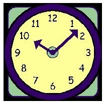

# Lazy Misha

Misha wants to play football with guys and was about to leave the house, but suddenly he was caught by mum who told that as long as Misha will not help her in the house, he will not go to the football. Mum suggested Misha to do one of three things: either to wash the dishes, or to vacuum the apartment, or to play with his younger sister Marina, while the mother goes to the store. Misha wondered how long it takes each case:

Washing the dished takes `t1` seconds
Vacuuming the apartment takes `t2` seconds
Playing with Marinka takes `t3` seconds
It is obvious that Misha will choose the work that takes the least time. Your program must write the time during which Misha will perform the mother's job.

## Input
Three integers `t1, t2, t3 (1 ≤ t1, t2, t3 ≤ 1000)`.

## Output
Print the minimum time to do the mum's job for Misha.